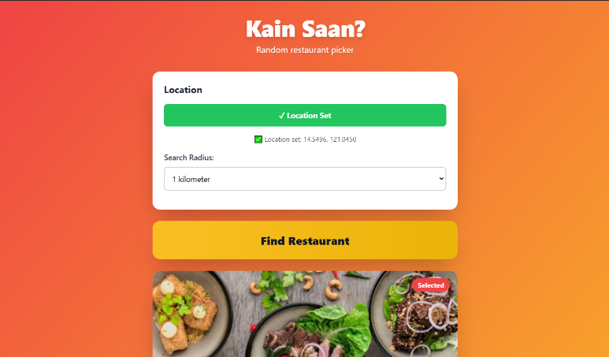
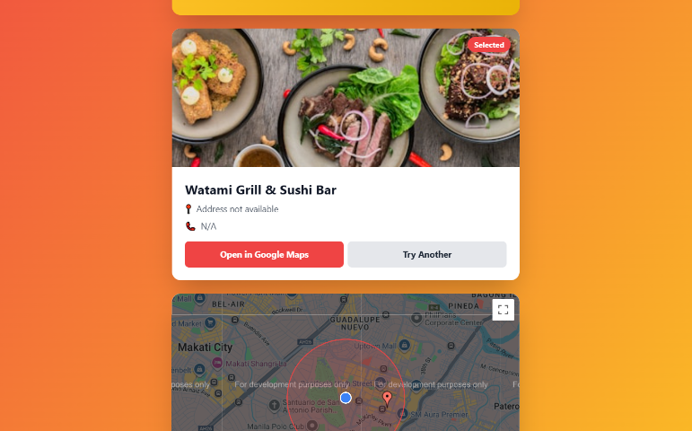

# Kain Saan

A mobile-first Progressive Web App that helps users discover nearby restaurants through random selection.




## About

Kain Saan is a location-based restaurant finder that uses geolocation to search for dining establishments within a configurable radius. Users can randomly select from nearby restaurants displayed on an interactive map.

## Tech Stack

**Backend**
- Django 5.0
- PostgreSQL
- OpenStreetMap Overpass API

**Frontend**
- Django Templates
- Tailwind CSS
- Vanilla JavaScript
- Google Maps JavaScript API

**Infrastructure**
- Docker & Docker Compose
- GitHub Actions
- Gunicorn

## Running Locally

1. Clone the repository:
```bash
git clone https://github.com/jabtechh/kainsaan.git
cd kainsaan
```

2. Copy environment file:
```bash
cp .env.example .env
```

3. Add your Google Maps API key to `.env`:
```env
GOOGLE_MAPS_API_KEY=your-api-key-here
```

4. Run with Docker:
```bash
docker-compose up --build
```

5. Open `http://localhost:8000`

## Contributing

I welcome contributions to Kain Saan. Feel free to create an issue regarding any bugs or desired features, and I'll respond when possible. If you want to contribute code, please fork this repository and create a pull request.

Please note that contributions should focus on the frontend and application logic. The external API integrations and service layer code should remain as-is for security and stability reasons.

## Planned Features

- Michelin-starred restaurant filter (search for awarded establishments nearby)
- Nearest carinderia finder (local eateries)

## License

MIT License